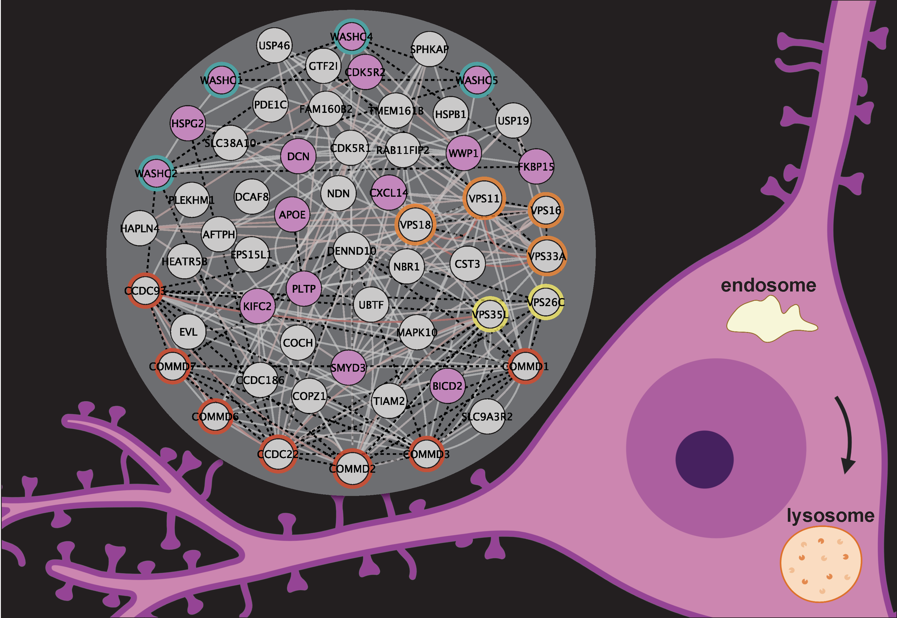

# SwipProteomics
This repository contains the raw [TMT](./inst/extdata/TMT.zip) 
and [BioID](./inst/extdata/BioID.zip) proteomics data associated with the
analyses performed by 
[Courtland _et al._, 2021](https://www.biorxiv.org/content/10.1101/2020.08.06.239517v1).

The analysis utilizes functions from
[soderling-lab/tidyProt](https://github.com/soderling-lab/tidyProt) to peform
protein- and module- level comparisions.
Key data and results are saved as R objects in `data/`. These can be accessed in
R using the `data()` function. 

The statistical results can be found in the `tables/` directory.

Maps for plasmids using in the study are in the `sequences/` directory.



## Usage Example

```R 
# download the repository as an R package
devtools::install_github("soderling-lab/SwipProteomics")

# tidyProt for statistical functions
devtools::install_github("soderling-lab/tidyProt")

library(dplyr)

library(tidyProt)
library(SwipProteomics)


# load the normalized data
data(swip_tmt)

# washc4's uniprot ID
data(swip)

# fit a model
fx <- log2(Intensity) ~ 0 + Condition + (1|Mixture)
fm <- lmerTest::lmer(fx,data=swip_tmt %>% subset(Protein==swip))

# create a contrast
LT <- getContrast(fm,"Mutant","Control")

# assess contrast 
res <- lmerTestContrast(fm, LT) %>% mutate(Contrast='Mutant-Control') %>% unique()

knitr::kable(res)

```

|Contrast       |    log2FC| percentControl|        SE| Tstatistic| Pvalue| DF|       S2|isSingular |
|:--------------|---------:|--------------:|---------:|----------:|------:|--:|--------:|:----------|
|Mutant-Control | -1.401866|      0.3784393| 0.0264791|  -52.94235|      0| 28| 0.007362|TRUE       |

lmerTestContrast returns a data.frame with statistics from the model-based
contrast. The column `isSingular=TRUE` in this case indicates that the variance
attributes to `Mixture` is negligible. 


```R

## fit WASH Complex

library(dplyr)
library(SwipProteomics)

data(washc_prots)

# module-level model includes ranef Protein
fx1 <- log2(rel_Intensity) ~ 0 + Condition + (1|Protein)

# fit the model
fm1 <- lmerTest::lmer(fx1, data = swip_tmt %>% subset(Protein %in% washc_prots))

# assess overall 'Mutant-Control' comparison
res1 <- lmerTestContrast(fm1, LT) %>% mutate(Contrast='Mutant-Control') %>% unique()

knitr::kable(res)

```

|Contrast       |    log2FC| percentControl|        SE| Tstatistic| Pvalue|  DF|        S2|isSingular |
|:--------------|---------:|--------------:|---------:|----------:|------:|---:|---------:|:----------|
|Mutant-Control | -1.379633|      0.3843165| 0.0392109|  -35.18497|      0| 151| 0.0645747|FALSE      |


## Citation
```
@article{Courtland2021,
	title        = {Genetic Disruption of WASHC4 Drives Endo-lysosomal Dysfunction and Cognitive-Movement Impairments in Mice and Humans},
	author       = {Jamie L. Courtland and Tyler W. A. Bradshaw and Greg Waitt and Erik J. Soderblom and Tricia Ho and Anna Rajab and
			Ricardo Vancini and Il Hwan Kim and Scott H. Soderling},
	year         = 2021,
	month        = {March},
	journal      = {eLife},
	doi          = {https://doi.org/10.7554/eLife.61590},
	url          = {none}
}
```
